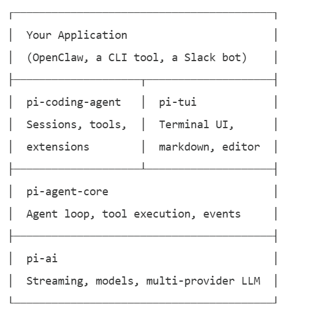

# How to Build a Custom Agent Framework with PI

PI is a TypeScript toolkit for building AI agents. It’s a monorepo of packages:
- `pi-ai`: handles LLM communication across providers
- `pi-agent-core`: adds the agent loop with tool calling
- `pi-coding-agent`: a full coding agent with built-in tools, session persistence, and extensibility
- `pi-tui`: provides a terminal UI for building CLI interfaces

## The stack

Each layer adds capability. Use as much or as little as you need.
- `pi-ai`: Call any LLM through one interface. Anthropic, OpenAI, Google, Bedrock, Mistral, Groq, xAI, OpenRouter, Ollama, and more. Streaming, completions, tool definitions, cost tracking
- `pi-agent-core`: Wraps `pi-ai` into an agent loop. You define tools, the agent calls the LLM, executes tools, feeds results back, and repeats until done
- `pi-coding-agent`: The full agent runtime. Built-in file tools (read, write, edit, bash), JSONL session persistence, context compaction, skills, and an extension system
- `pi-tui`: Terminal UI library with differential rendering. Markdown display, multi-line editor with autocomplete, loading spinners, and flicker-free screen updates

